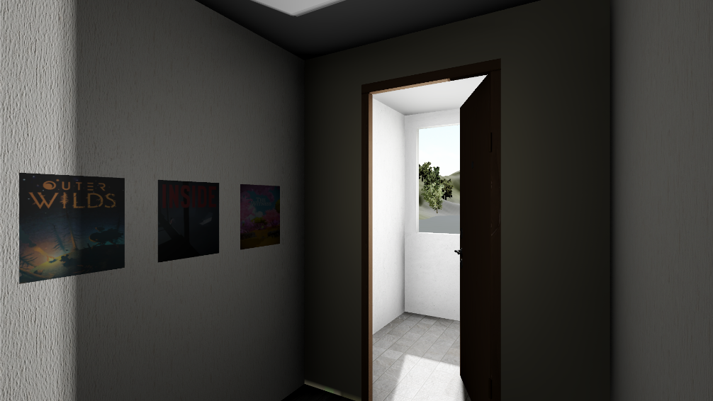
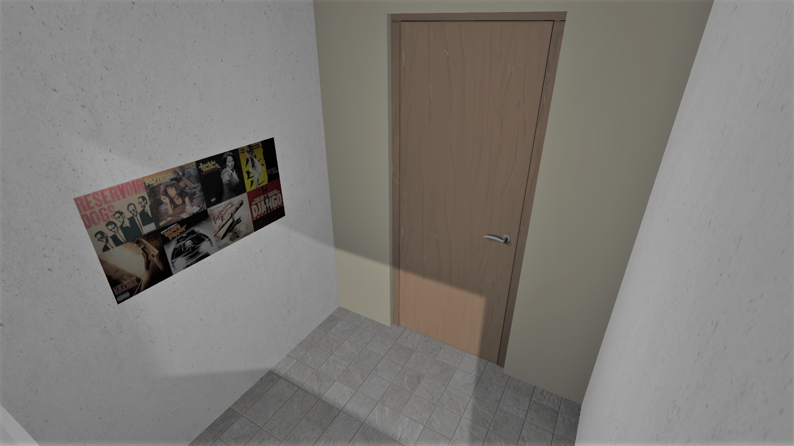
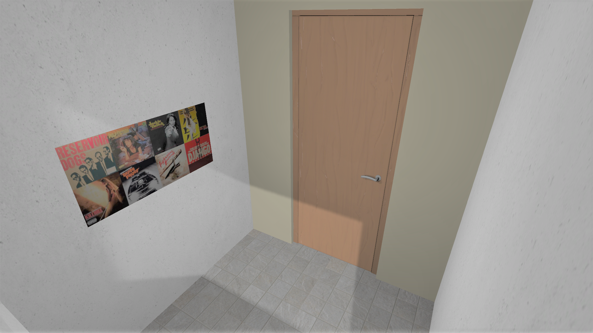
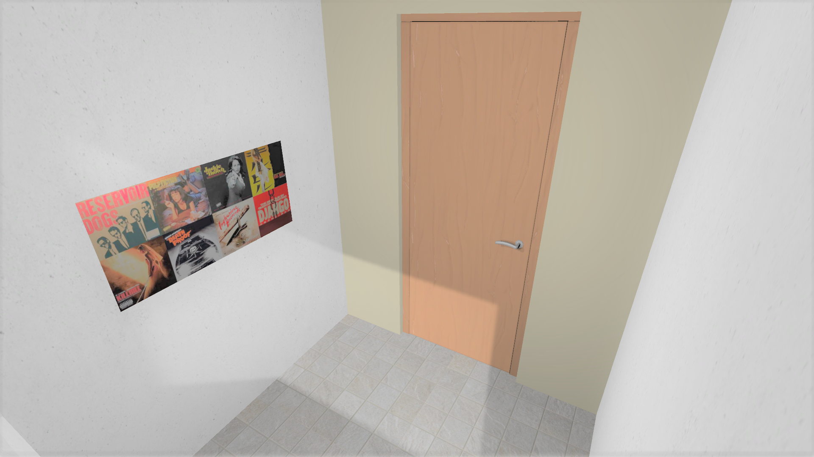
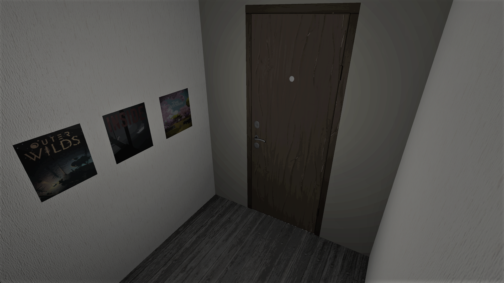
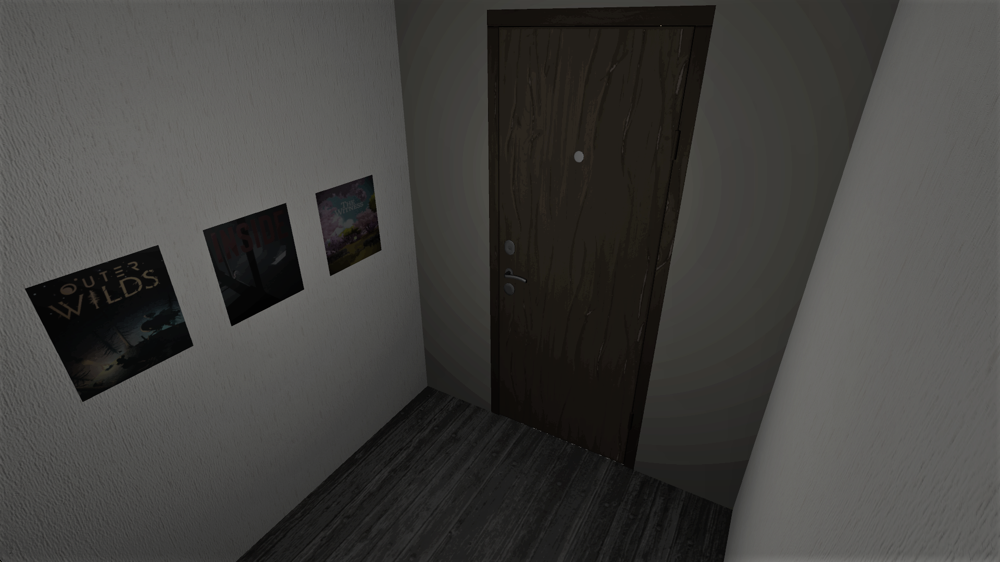
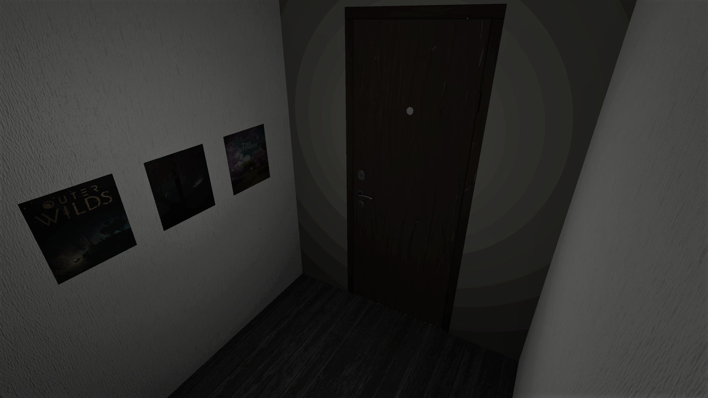

# 3D-TMO

Unity project of 3D-TMO: [Tone mapping High Dynamic 3D scenes with global lightness coherency](https://igoude.github.io/).

> "Tone mapping High Dynamic 3D scenes with global lightness coherency; I. Goudé, J. Lacoche, R. Cozot; Computer & Graphics (2020); https://doi.org/10.1016/j.cag.2020.08.004"

## Requirements

Unity 2019.2.4f1  
SteamVR (up to date)  
This TMO has been developed using an HTC Vive pro HMD

## Abstract

We propose a new approach for real-time Tone Mapping Operator dedicated to High Dynamic Range rendering of interactive 3D scenes.  
The proposed method considers the whole scene lighting in order to preserve the global coherency.

<html>
    <body>
        

            
        

    </body>
</html>   

The 3D scene consists of two rooms, one very bright and one very dark, separated by a door.

  

<html>
    <body>
        

            
             
              
            
            
            
        

    </body>
</html>

Comparison between Viewport TMO (left), Global TMO (right) and the combination of both TMOs (middle) for two different viewpoints in the scene.

## Contact

> Ific Goudé  
Research Scientist in Computer Graphics  
Email: goude.ific@gmail.com  
Website: [https://igoude.github.io/](https://igoude.github.io/)
